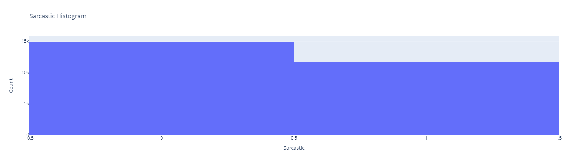
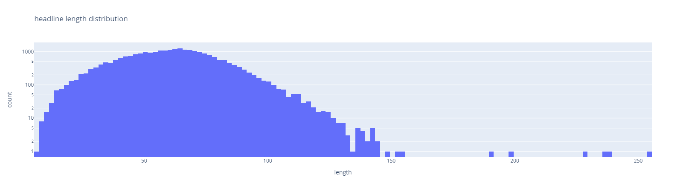

# Reporte de Datos

Este documento contiene los resultados del análisis exploratorio de datos.

## Resumen general de los datos

Nuestro conjunto de datos se compone de un total de 26709 observaciones y cuenta con 3 variables: article_link, head_line y is_sarcastic.

Article_link es una variable de tipo String y corresponde al hipervínculo de la noticia original. La variable headline es tambien de tipo String e indica el titular de la noticia, por último, is_sarcastic es de tipo Integer y toma valores de 0 ó 1 indicando si el headline descrito es de carácter sarcástico o no. 

Por otro lado, el dataset no cuenta con valores faltantes en ninguna de sus columnas, aunque si se identificaron algunos valores repetidos (107 en total). Eliminando dichos valores, tanto en la columna article_link como head_line todos su valores son únicos mientras que la columna is_sarcastic cuenta con 14951 entradas con valor 0 y 11651 de valor 1, es decir, una distribución de 56%-41% lo que nos indica que hay una leve desproporción de los datos hacia aquellos headlines que no son considerados como sarcásticos.

## Resumen de calidad de los datos

El dataset parece estar bstante bien documentado en el sentido que no cuenta con valores faltantes en ninguna de sus columnas. Por otra parte, la columna headline la cual se espera que tenga únicamente valores únicos realmente cuenta con 107 valores duplicados, por lo que optamos por deshacernos de las filas donde se presenta dicha duplicidad. Por ultimo, la variable “is_sarcastic” confirmamos que únicamente cuenta con valores 0 y 1 como se espera, por lo que el dataset no contiene valores extremos o que se cataloguen como erróneos.

## Variable objetivo

la columna is_sarcastic la cual se toma como la variable objetivo cuenta con 26602 entradas (Después de eliminar duplicados) las cuales toman valor de 0 y 1 e indican si la entrada el headline de la noticia asociada es de carácter sarcástico o no. Al analizar la distribución de esta variable vemos que esta cuenta con 14591 filas con valor 0 y 11651 de valor 1, es decir, una distribución de 56%-41% lo que nos indica que hay una leve desproporción de los datos hacia aquellos headlines que no son considerados como sarcásticos.

## Variables individuales

En cuanto las variables individuales, al tratarse de un corpus donde la variable objetivo es la única de tipo Integer no se pueden manejar directamente relaciones con esta. Por otro lado, es interesante ver la distribución de la longitud de los headlines la cual se observa en la siguiente gráfica:
 

Vemos que la longitud de los headlines sigue una distribución normal con algunos valores extremos de más de 150 caracteres. Por otro lado, analizando este aspecto de manera estadística, vemos que la longitud de mayor frecuencia se encuentra entre 64 y 65 caracteres con 1273 apariciones, el headline de menor longitud cuenta con tan solo 7 caracteres, mientras que el de mayor longitud contiene hasta 254. Por ultimo, la media de longitud es de 61 caracteres.

## Ranking de variables

El corpus cuenta únicamente con 2 variables de tipo String (Además de la variable objetivo). La primera de estas variables es “article_link” la cual sirve únicamente con variable complementaria ya que esta corresponde al hipervínculo de la noticia original (Útil por si algún usuario quisiera indagar mas sobre alguna noticia en especifico), por lo que esta variable no aporta ninguna información relevante para predecir la variable objetivo. 

Por lo tanto, dicha variable objetivo depende única y exclusivamente de la información aportada por la variable “headline” la cual indica el titular de la noticia ya que de hecho el objetivo del corpus es precisamente identificar si el titular de una noticia tiene un tono sarcastico o no.

## Relación entre variables explicativas y variable objetivo

Al ser un corpus donde únicamente se tiene una variable explicativa “headline” la cual es de tipo String, mientras que, la variable objetivo es de tipo Integer por lo que no se pueden manejar directamente relaciones con esta.
