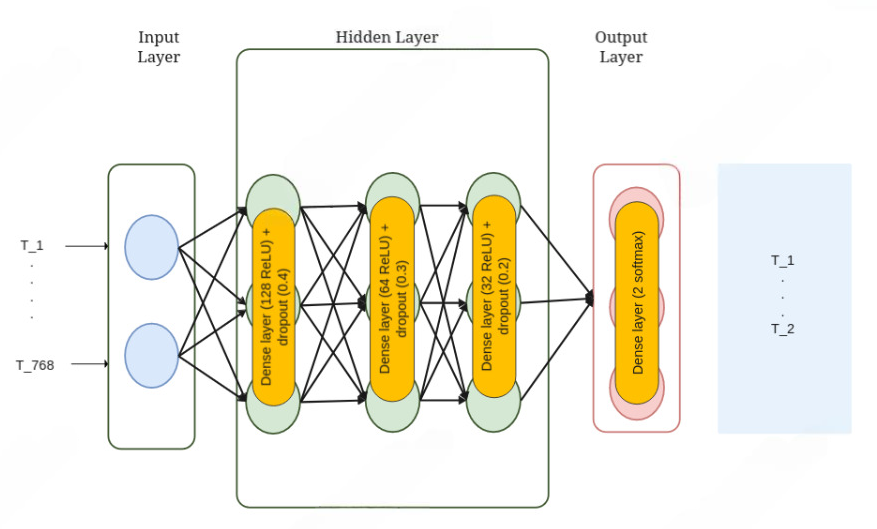

# Reporte del Modelo Final

## Resumen Ejecutivo

En esta sección se presentará un resumen de los resultados obtenidos del modelo final. Es importante incluir los resultados de las métricas de evaluación y la interpretación de los mismos.

## Descripción del Problema

El problema que se buscó resolver con el modelo final es la detección de sarcasmo en titulares de noticias. En el contexto actual de las redes sociales y la difusión masiva de información, es crucial poder identificar el sarcasmo para mejorar la comprensión y el procesamiento de los textos. El objetivo principal es desarrollar un modelo que pueda clasificar automáticamente si un titular es sarcástico o no, utilizando técnicas avanzadas de procesamiento del lenguaje natural y aprendizaje automático.

## Descripción del Modelo

Para resolver el problema de clasificación de sarcasmo en titulares de noticias, se desarrolló un modelo basado en una red multicapa compuesta de capas densas. Este modelo y sus respectivas metrícas está guardado en [MLflow](../../scripts/modeling/mlruns/) con el nombre de 'NN-BinaryCross-RMSprop'. El modelo se diseñó utilizando las siguientes características y técnicas:

- **Embeddings**: Se utilizaron embeddings de BERT para representar los titulares en un espacio vectorial continuo.
- **Capas Densas**: El modelo consta de varias capas densas (fully connected layers) que permiten la transformación y combinación de las características extraídas de los embeddings.
- **Capas Dropout**: Entre cada capa densa intermedia se agrega una capa dropout para prevenir el overfitting del modelo a los datos.
- **Función de Activación**: Se emplearon funciones de activación ReLU en las capas intermedias y una función 'softmax' en la capa de salida para obtener una probabilidad de que pertenezca a cada categoría.
- **Optimización**: Se utilizó el optimizador RMSprop para el ajuste de los pesos del modelo, debido a su naturaleza adaptativa que le permite ajustar la tasa de aprendizaje de forma automática. 
- **Pérdida**: Se utilizó la función de pérdida Binary Crossentropy, que es comúnmente utilizada en problemas de clasificación binaria.

## Evaluación del Modelo

La evaluación del modelo se realizó utilizando varias métricas debido a la naturaleza de la tarea de clasificación binaria. A continuación se presentan los resultados obtenidos:

- **Precisión (Accuracy)**: La precisión del modelo en el conjunto de prueba fue del 89%, lo que indica que el modelo es capaz de clasificar correctamente los titulares sarcásticos con una alta efectividad.
- **F1-Score**: El F1-Score del modelo fue del 87.1%, proporcionando un balance entre la precisión y la exhaustividad.
- **Precisión (Precision)**: La precisión del modelo fue del 89.3%, lo que refleja el porcentaje de titulares que fueron clasificados correctamente como sarcásticos sobre todos los titulares predichos como sarcásticos.
- **Exhaustividad (Recall)**: La exhaustividad del modelo fue del 85.1%, indicando el porcentaje de titulares sarcásticos que fueron correctamente identificados por el modelo.
- **Matriz de Confusión**: Se adjunta una matriz de confusión para visualizar el rendimiento del modelo en términos de verdaderos positivos (VP), verdaderos negativos (VN), falsos positivos (FP) y falsos negativos (FN).

|          | Predicción Positiva | Predicción Negativa |
|----------|---------------------|---------------------|
| **Real Positivo** | VP 2689 | FN 307 |
| **Real Negativo** | FP 297 | VN 2049 |

Estos resultados demuestran que el modelo tiene un buen rendimiento en la clasificación de titulares sarcásticos y no sarcásticos, balanceando precisión y exhaustividad.

## Conclusiones y Recomendaciones

A partir de los resultados obtenidos, se pueden extraer las siguientes conclusiones y recomendaciones:

- **Puntos Fuertes**: El modelo demostró ser efectivo en la clasificación de sarcasmo, gracias al uso de embeddings avanzados y una arquitectura de red adecuada.
- **Puntos Débiles**: Una posible limitación del modelo es su dependencia de los datos de entrenamiento; es posible que no generalice bien a titulares de noticias muy diferentes a los utilizados en el entrenamiento.
- **Recomendaciones**: Se recomienda continuar mejorando el modelo con más datos y probar otras arquitecturas de red, para evaluar posibles mejoras en el rendimiento.

## Referencias

- Kaggle: [News Headlines Dataset for Sarcasm Detection](https://www.kaggle.com/datasets/rmisra/news-headlines-dataset-for-sarcasm-detection/data)
- Devlin, J., Chang, M.-W., Lee, K., & Toutanova, K. (2019). BERT: Pre-training of Deep Bidirectional Transformers for Language Understanding.